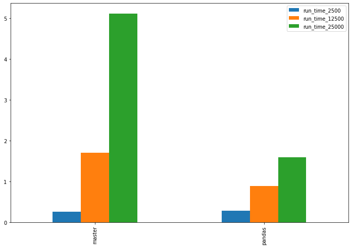

[comment]: # (This presentation was made with markdown-slides -> https://github.com/dadoomer/markdown-slides)
[comment]: # (This is a CommonMark compliant comment. It will not be included in the presentation.)
[comment]: # (Compile this presentation with the command below)
[comment]: # (mdslides slides.md --include media)

[comment]: # (Set the theme:)
[comment]: # (THEME = white)
[comment]: # (CODE_THEME = base16/zenburn)
[comment]: # (The list of themes is at https://revealjs.com/themes/)
[comment]: # (The list of code themes is at https://highlightjs.org/)

[comment]: # (Pass optional settings to reveal.js:)
[comment]: # (controls: true)
[comment]: # (keyboard: true)
[comment]: # (markdown: { smartypants: true })
[comment]: # (hash: false)
[comment]: # (respondToHashChanges: false)
[comment]: # (Other settings are documented at https://revealjs.com/config/)

# Pandas

[comment]: # (A comment starting with three or more !!! marks a slide break.)
[comment]: # (!!!)


Not the kind of Pandas we are going to talk about

[comment]: # (!!!)


Pandas - Python Data Analysis Library

[comment]: # (!!!)

###### Brief history lesson...

[comment]: # (!!!)

- 2007 - Applied Quantitative Research Captial Management (AQR)
- They're a hedge fund managing many billions of dollars at that time

[comment]: # (!!!)

<!-- .element: style="height:50vh; max-width:80vw;" -->

AQR hires Wes McKinney

[comment]: # (!!!)

- Bachelor's from MIT in Mathematics
- Found all AQR's hard finance problems awful to do with the tooling available
    - More time spent on the data than the math
- Did not like Excel and R (a statistical programming language)
- Immediately fell in love with Python

[comment]: # (!!!)

- Wes builds internal tooling at AQR in Python
- Somehow convinces AQR to open source it (?!)
- Wes eventually leaves AQR but keeps working on Pandas
    - Companies actually paid him to develop and maintain it

[comment]: # (!!!)

###### What is the big deal?

[comment]: # (!!!)

- Jump started a revolution in data analysis of useful tools in an approachable language
- Pandas uses Python as glue code to bring together powerful and high performance tools in easy to use ways
- Treats data like a in-memory SQL table, using something called a DataFrame
- Named from **pan**el **da**ta in statistics

[comment]: # (!!!)


column => pandas.Series

Series are the secret sauce allowing a whole ton of fast, effective manipulations and calculations

[comment]: # (!!!)

###### The words "fast" and "Python" together

You are missing a "not" aren't you

[comment]: # (!!!)

Series (and Pandas in general) makes heavy use of NumPy

NumPy is Python's numerical computing dark magic library

[comment]: # (!!!)

###### What qualifies as "fast"

[comment]: # (!!!)

```python [1|2-6|7]
def loop_mean(list):
    total = 0
    count = 0
    for entry in list:
        total += entry
        count += 1
    return total / count
```

A simple loop in Python

[comment]: # (!!!)

```python [1|2]
def mean(list):
    return sum(list) / len(list)
```

The `sum` and `len` are implemented in C

[comment]: # (!!!)

```python [1-2|3]
import numpy as np
def numpy_mean(np_arr):
    return np.mean(np_arr)
```
Using a `numpy.array` with `numpy.mean`

[comment]: # (!!!)

- Raspberry Pi 4 (1GB)
- CPython 3.9
- Single core, single thread
- CProfile reported cumulative time

[comment]: # (!!!)

| length | loop_mean | mean | numpy_mean |
| ------ | ----- | ----- | ----- |
| 10 000 | 2 ms | 1 ms | 1 ms |
| 100 000 | 26 ms | 1 ms | 1 ms|
| 1 000 000 | 249 ms | 13 ms | 4 ms |
| 10 000 000 | 2482 ms | 130 ms | 33 ms |

[comment]: # (!!!)

###### Min-Max Normalization  

Scales the range of values to [0, 1]

`$$ norm(x) = \dfrac{x - min(x)}{max(x) - min(x)} $$`

[comment]: # (!!!)

```python [1-2|3-9|10-15]
import math
def loop_norm(list):
    list_max = -math.inf
    list_min = math.inf
    for entry in list:
        if entry < list_min:
            list_min = entry
        if entry > list_max:
            list_max = entry
    result = []
    for entry in list:
        result.append(
            (entry - list_min) / (list_max - list_min)
        )
    return result
```

[comment]: # (!!!)

```python [1|2-3|4-7]
def norm(list):
    list_max = max(list)
    list_min = min(list)        
    return [
        (entry - list_min)/(list_max - list_min)
        for entry in list
    ]
```

`max` and `min` are implemented in C

List comprehensions are a common optimization tactic

[comment]: # (!!!)

```python [1-2|3-5]
import numpy as np
def numpy_norm(np_arr):
    return 
        (np_arr - np.min(np_arr)) / 
        (np.max(np_arr) - np.min(np_arr))
```

Using a `numpy.array` with `numpy.min` & `numpy.max`

[comment]: # (!!!)

| length | loop_norm | norm | numpy_norm |
| ------ | ----- | ----- | ----- |
| 10 000 | 49 ms | 3 ms | 1 ms |
| 100 000 |  493 ms | 33 ms | 5 ms|
| 1 000 000 | 4949 ms | 321 ms | 37 ms |
| 10 000 000 | 49649 ms | 3201 ms | 357 ms |

[comment]: # (!!!)

###### What is Numpy's secret?

[comment]: # (!!!)

- `numpy.array`s are arranged for memory and processor efficiency
- Highly optimized, precompiled, vectorized C operations
    - Runs simultaneously over many values instead of just one at a time
- Less overhead than writing your own C, C++, Rust extensions
- It can cheat at times on multipe cores/threads [BLAS](https://en.wikipedia.org/wiki/Basic_Linear_Algebra_Subprograms)

[comment]: # (!!!)

###### How SkillShark got into using Pandas

- Little bit of NumPy used on some writes
- SQL and Django ORM used on most reads
    - These were starting to suffer with scale/complexity  
- CSV files processed in JS
    - Would die in the browser at triple digit row counts

[comment]: # (!!!)

###### Score Processors

[comment]: # (!!!)

```python [1|2-12|13]
import pandas as pd
scores = [
    {
        "id": 1,
        "raw_value": 6.67,
        "player_id": 2,
        "event_id": 3,
        "evaluator_id": 4,
        "metric_id": 5,
        "lower_is_better": False,
    }
]
df = pd.DataFrame.from_records(data=scores)
```

[comment]: # (!!!)

```python [1|2|3]
df = df.dropna(subset=["raw_value"])
df = df.drop(columns=["id"])
metrics = df.groupby("metric_id")
```

[comment]: # (!!!)

```python [1-2|3-4]
df["max"] = metrics["raw_value"].transform("max")
df["min"] = metrics["raw_value"].transform("min")
player_metrics = df.groupby(["player_id", "metric_id"])
df["avg"] = player_metrics["raw_value"].transform("mean")
```

[comment]: # (!!!)

```python [1-2|3-4]
df.loc[~df["lower_is_better"], "norm"] =
    (df["avg"] - df["min"]) / (df["max"] - df["min"])
df.loc[df["lower_is_better"], "norm"] =
    (df["max"] - df["avg"]) / (df["max"] - df["min"])
```

[comment]: # (!!!)

```python [1|2-5|6]
df = df.drop_duplicates(subset=["player_id", "metric_id"])
df["rank"] = metrics["norm"].rank(
    ascending=False,
    method="min"
)
df["rank_total"] = metrics["player_id"].transform("size")
```

[comment]: # (!!!)

```python [1|]
result = df.to_dict(orient="records")
"""
result = [
    {
        "raw_value": 6.67,
        "player_id": 2,
        "event_id": 3,
        "evaluator_id": 4,
        "metric_id": 5,
        "lower_is_better": False,
        "max": 9.98,
        "min": 2.43,
        "avg": 5.55,
        "norm": 0.87,
        "rank": 5,
        "rank_total": 25
    }
]
"""
```

[comment]: # (!!!)

###### Dec 2021 - Score Processor Improvements



[comment]: # (!!!)

###### Player Import

[comment]: # (!!!)

```python [1|2|4]
if file.content_type == 'text/csv':
    original_df = pd.read_csv(file)
else:
    original_df = pd.read_excel(file)
```

[comment]: # (!!!)

```python [1-5|6|7]
mapping = {
    "first_name": 0,
    "last_name": 1,
    "email": 2,
}
all_columns = range(len(df.columns))
unmapped_columns = set(all_columns).difference(mapping.values())
```

[comment]: # (!!!)

```python [1|2-5|6|7|8-11]
df = original_df.rename(
    columns={
        df.columns[index]: name
        for name, index in mapping.items()
    },
    errors='raise'
).drop(
    columns=[
        df.columns[unmapped_column]
        for unmapped_column in unmapped_columns
    ]
)
```

[comment]: # (!!!)

```python [1-3|4|5|6|7|8|9|10]
existing_df = pd.Dataframe.from_records(
    data=list_of_existing_players
)
df = pd.merge(
    existing_df,
    df,
    how="outer",
    suffixes=["_existing", "_uploaded"],
    on=["first_name", "last_name"],
    indicator="_merge"
)
```

`df["_merge"]` shows `left_only`, `both`, `right_only`

Tell us which players are not in the upload, updated, and added respectively

[comment]: # (!!!)

```python [1|2|4|5]
df = df.drop(
    df.loc[df["_merge"] == "left_only", :].index
)
to_update_df = df.loc[df["_merge"] == "both", :]
to_create_df = df.loc[df["_merge"] == "right_only", :]
```

Drop any row we are not updating or creating, based on it's index

Slice off the players we want to update, and create

[comment]: # (!!!)

```python [1|2-5|6|8|9|11]
def validate_condition_on_df(df, condition, msg, errors_df):
    failed = df.loc[
        condition,
        ["first_name", "last_name"]
    ].copy()
    failed["error"] = msg

    errors_df = errors_df.append(failed)
    df = df.drop(failed.index)

    return df, errors_df
```
For `condition`, check `df` for any failing rows
    
Extract the failed rows to `errors_df` and append the given `msg` to the `error` column

[comment]: # (!!!)

```python [1-4|5-10]
condition = df.duplicated(
    subset=["first_name", "last_name"],
    keep="first"
)
df, errors_df = validate_condition_on_df(
    df=df,
    condition=condition,
    error_msg='a player with that name was already found in the upload',
    errors_df=errors_df
)
```

[comment]: # (!!!)

```python [1|2|3|4|5-8|9|11|12]
output_df = pd.merge(
    original_df,
    errors_df,
    how='right',
    left_on=[
        original_df.columns[mapping["first_name"]],
        original_df.columns[mapping["last_name"]],
    ],
    right_on=["first_name", "last_name"]
)
output_df = output_df.drop(columns=["first_name", "last_name"])
csv = output_df.to_csv(index=False)
```

Merge the errors back into the original data and return to the user

They can fix any errors then resubmit, successful creates and updates still occur

[comment]: # (!!!)

###### Financial stuff

[comment]: # (!!!)

```python [1-4|5-7|8]
quarterly_totals = find_payment_totals_for_quarter(
    start_date=start_date,
    end_date=end_date
)
df = pd.DataFrame.from_records(
        data=quarterly_totals
    ).sort_values(['year', 'quarter'])
df['arr'] = df['total'].rolling(4, min_periods=1).sum()
```

Calculate `df["arr"]` as the sum of the last 4 quarters

[comment]: # (!!!)

```python
dates = {'date': [
    '1/1/2021',
    '3/31/2021',
    '4/1/2021',
    '6/30/2021',
    '7/1/2021',
    '9/30/2021',
    '10/1/2021',
    '12/31/2021'
]}
```

[comment]: # (!!!)

```python [1|2|3|4-5]
df = pd.DataFrame(dates)
df['date'] = pd.to_datetime(df['date'])
df['fiscal'] = df['date'].dt.to_period('Q-SEP')
df['year'] = df['fiscal'].dt.qyear
df['quarter'] = df['fiscal'].dt.quarter
```
[comment]: # (!!!)

| index | date | fiscal | year | quarter |
| ----- | ----- | ----- | ----- | ----- | 
| 0 | 2021-01-01 | 2021Q2 | 2021 | 2 |
| 1 | 2021-03-31 | 2021Q2 | 2021 | 2 |
| 2 | 2021-04-01 | 2021Q3 | 2021 | 3 |
| 3 | 2021-06-30 | 2021Q3 | 2021 | 3 |
| 4 | 2021-07-01 | 2021Q4 | 2021 | 4 |
| 5 | 2021-09-30 | 2021Q4 | 2021 | 4 |
| 6 | 2021-10-01 | 2022Q1 | 2022 | 1 |
| 7 | 2021-12-31 | 2022Q1 | 2022 | 1 |

[comment]: # (!!!)

```python [1|3|4|5-11|12|13]
df.info()
"""
<class 'pandas.core.frame.DataFrame'>
RangeIndex: 8 entries, 0 to 7
Data columns (total 4 columns):
 #   Column   Non-Null Count  Dtype         
---  ------   --------------  -----         
 0   date     8 non-null      datetime64[ns]
 1   fiscal   8 non-null      period[Q-SEP] 
 2   year     8 non-null      int64         
 3   quarter  8 non-null      int64         
dtypes: datetime64[ns](1), int64(2), period[Q-SEP](1)
memory usage: 384.0 bytes
"""
```

[comment]: # (!!!)

# The Good

- Abusing vectorized operations is free *speed*
- Easy data wrangling and manipulation
- Seamless hookup to the rest of the Python ecosystem
- Flexible and fully featured out of the box

[comment]: # (!!!)

# The Bad

- Your data set has to fit in-memory
- Style is *different* from normal Python
- Testing can be tricky (`assertDataFrameEqual`)
    - Easier to black box test with Python primitives

[comment]: # (!!!)

Getting Started & Resources

- [Python For Data Analysis by Wes McKinney](https://wesmckinney.com/book/preface.html)
- [Pandas Docs](https://pandas.pydata.org/docs/getting_started/overview.html)
- Jupyter Notebooks
    - [Datalore](https://datalore.jetbrains.com/) & [DataSpell](https://www.jetbrains.com/dataspell/)
    - [VS Code](https://code.visualstudio.com/docs/datascience/jupyter-notebooks)

[comment]: # (!!!)

Other Works

- [Modin](https://github.com/modin-project/modin) - Multi-threaded Pandas
- [Dask](https://docs.dask.org/en/stable/) - Limit is "fits on disk"
- [Polars](https://www.pola.rs/) - Rust clone of Pandas
- [Vaex](https://github.com/vaexio/vaex) - "Billions of rows/second"
- [Arrow](https://arrow.apache.org/)
    - Wes McKinney's new hotness
    - Language independent DataFrames
    - Helps cross system communication

... and more

[comment]: # (!!!)

Questions?
